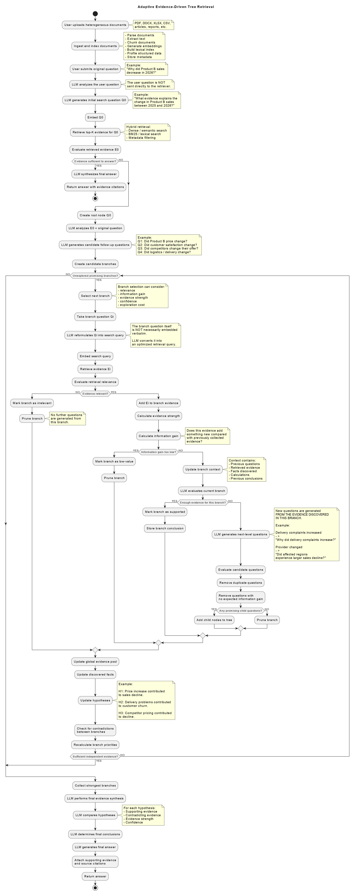

# Adaptive Evidence-Driven Tree Retrieval

Python implementation (Clean Architecture / Clean Code) of the provided UML
diagram, using a **local LLM via Ollama (`qwen3:8b`)**.

## Architecture



```
domain/            Pure business entities (Document, Chunk, Evidence, Branch,
                    Hypothesis, FinalAnswer, EvidenceTree). No external dependency.

application/
  ports/            Interfaces (LLMPort, EmbeddingPort, VectorStorePort,
                     LexicalIndexPort, DocumentParserPort, DocumentRepositoryPort)
  services/          Orchestrated business logic:
                       - QueryGenerationService     (query generation / reformulation)
                       - RetrievalService            (hybrid dense+lexical search)
                       - EvidenceEvaluatorService     (relevance, sufficiency, information gain)
                       - BranchExplorationService     (sub-question generation, priorities)
                       - HypothesisService             (hypotheses, contradictions)
                       - SynthesisService                (final answer)
  use_cases/
    ingest_documents_use_case.py   Ingestion pipeline
    answer_question_use_case.py    Orchestrator = the full UML flow

infrastructure/     Concrete implementations of the ports:
  llm/               OllamaLLMAdapter (qwen3:8b, via /api/chat)
  embeddings/        OllamaEmbeddingAdapter (nomic-embed-text by default)
  vector_store/      InMemoryVectorStore (numpy, cosine similarity)
  lexical/           BM25LexicalIndex (rank_bm25)
  chunking/          TextChunker (sliding window with overlap)
  parsers/           PdfParser, DocxParser, XlsxCsvParser, TxtParser + factory
  repositories/      InMemoryDocumentRepository

config/settings.py  Centralized configuration (env vars)
main.py             Composition root + CLI
```

Each layer only depends on the layer directly beneath it
(`infrastructure` -> `application` -> `domain`), never the other way
around. Any new implementation (e.g. Chroma instead of the in-memory
store, OpenAI instead of Ollama) plugs in by simply implementing the
matching port, without touching the domain or the use cases.

## Mapping to the UML diagram

| Diagram step                          | Component                                            |
| ------------------------------------- | ---------------------------------------------------- |
| Ingest and index documents            | `IngestDocumentsUseCase`                             |
| LLM generates Q0                      | `QueryGenerationService.generate_initial_question`   |
| Retrieve top-K evidence (hybrid)      | `RetrievalService.retrieve`                          |
| Evidence sufficient?                  | `EvidenceEvaluatorService.is_sufficient`             |
| Create root node / candidate branches | `AnswerQuestionUseCase.execute` + `EvidenceTree`     |
| Branch selection (priority)           | `EvidenceTree.select_next_branch`                    |
| Reformulate Qi into search query      | `QueryGenerationService.reformulate_branch_question` |
| Evaluate relevance / prune            | `EvidenceEvaluatorService.is_relevant`               |
| Information gain / prune              | `EvidenceEvaluatorService.information_gain`          |
| Generate next-level questions         | `BranchExplorationService.generate_child_questions`  |
| Update hypotheses / contradictions    | `HypothesisService`                                  |
| Recalculate branch priorities         | `BranchExplorationService.recalculate_priority`      |
| Final synthesis + citations           | `SynthesisService.synthesize`                        |

## Installation

```bash
# 1. Install Ollama: https://ollama.com
ollama pull qwen3:8b
ollama pull nomic-embed-text   # dedicated embedding model

# 2. Python dependencies
pip install -r requirements.txt --break-system-packages
```

## Usage

The vector store and lexical index are **in-memory**: use the session
mode to ingest and then query within the same process.

```bash
python main.py session
> ingest data/sales_report.pdf data/catalog.xlsx
> ask Why did Product B sales decrease in 2026?
> quit
```

Or as two separate scriptable commands (adapt this if you plug in a
persistent vector store in the infrastructure layer):

```bash
python main.py ingest file1.pdf file2.docx
python main.py ask "Your question here"
```

## Configuration (environment variables)

| Variable                 | Default                  | Description                                  |
| ------------------------ | ------------------------ | -------------------------------------------- |
| `OLLAMA_BASE_URL`        | `http://localhost:11434` | Ollama server URL                            |
| `OLLAMA_LLM_MODEL`       | `qwen3:8b`               | Reasoning model                              |
| `OLLAMA_EMBEDDING_MODEL` | `nomic-embed-text`       | Embedding model                              |
| `MAX_TREE_DEPTH`         | `4`                      | Max tree depth                               |
| `MAX_ITERATIONS`         | `25`                     | Safeguard against infinite loops             |
| `RELEVANCE_THRESHOLD`    | `0.35`                   | Branch relevance threshold                   |
| `INFO_GAIN_THRESHOLD`    | `0.15`                   | Minimum information gain threshold           |
| `MIN_SUPPORTED_BRANCHES` | `2`                      | Min number of independent supported branches |

See `config/settings.py` for the full list.

## Extending the system

- **Real persistence**: implement `VectorStorePort` / `LexicalIndexPort`
  with Chroma, Qdrant, or Elasticsearch.
- **Another LLM**: implement `LLMPort` (e.g. an OpenAI-compatible adapter).
- **New document format**: implement `DocumentParserPort` and register it
  in `DocumentParserFactory`.
